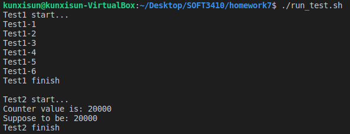

# How to run my test:
* go to the directory where the file "run_test.sh" locates
* run this in terminal to give permission: chmod +x ./run_test.sh
* run this in terminal: ./run_test.sh

You should be able to see the following output:

# How do I test:

* test1.c contain all the unit tests
* test2.c check the spinlock can handle multiple threads and on normal object (entry)
